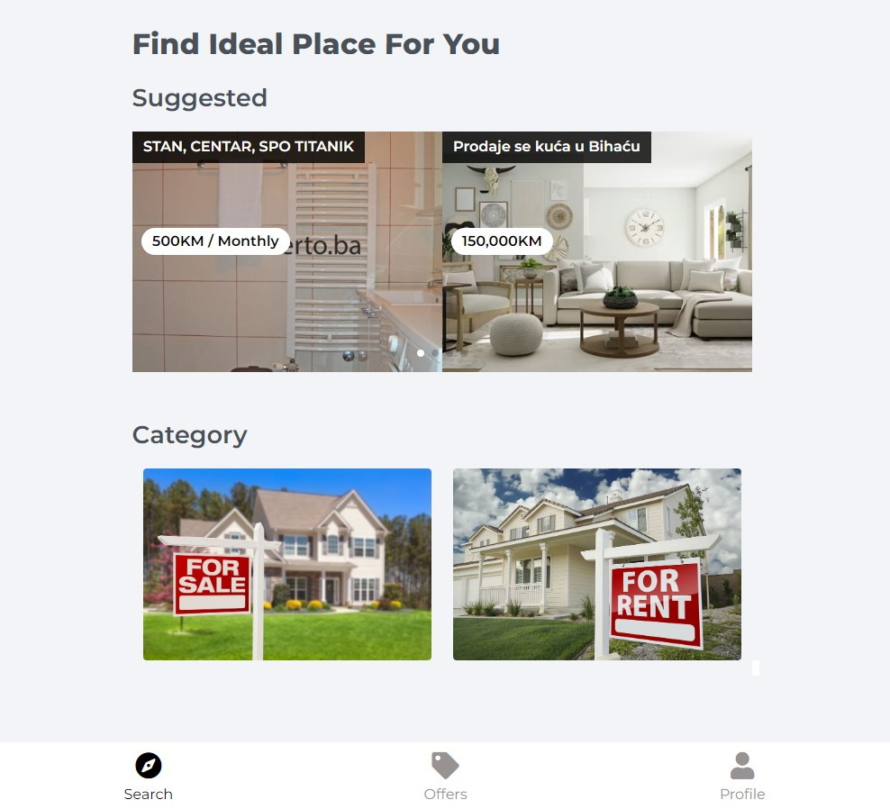

# TradeShop

---

### Application deployed to Heroku

### Link - [Real Estates](https://real-estates-mern.herokuapp.com/)

---

## Characteristics

- Listings
  - Get Listings - /api/v1/listings  /GET
  - Get Listing - /api/v1/listings/:id  /GET
  - Get User Listings
  - Delete Listing - /api/v1/listings/:id /DELETE
  - Create Listing - /api/v1/listings  /POST
  - Update Listing - /api/v1/listings  /PUT
  - Advanced Filtering - /api/v1/listings?category&limit=5&sort=-createdAt
- Auth
  - Register user - /api/v1/auth/register  /POST
  - Login user - /api/v1/auth/login  /POST
  - Confirm Email - /api/v1/auth/confirmEmail  /GET
  - Forgot Password
  - Reset Password
  - Get logged user - /api/v1/auth/me  /GET
- Images
  - Upload User Profile Photo - /api/v1/auth/upload  /POST
  - Upload images for listing
  - Remove image from listing - /api/v1/listings/:id/images/:image_id  /DELETE
- Leaflet Map

---

## License

MIT Licencs

Author rights(c) Kenan Dropić.
